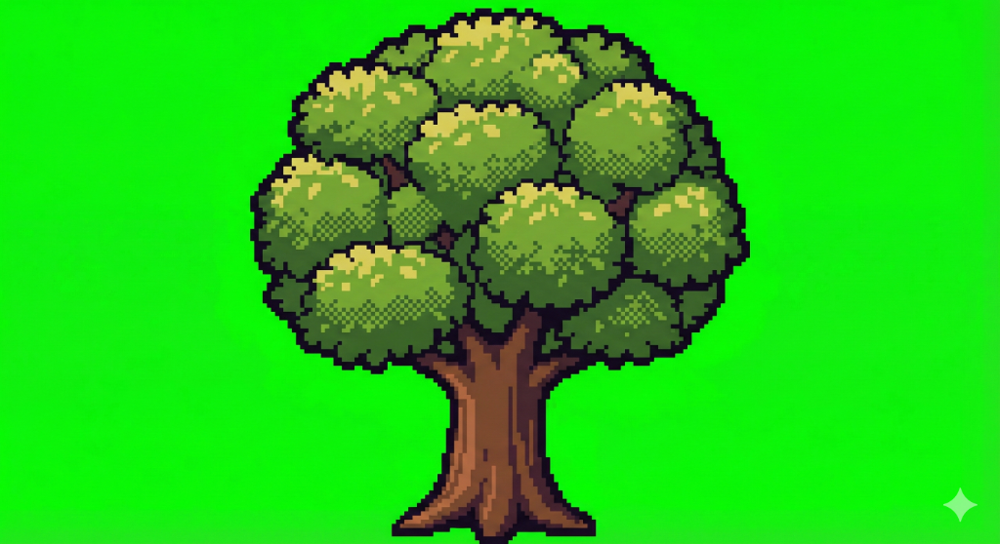

# I2g - AI Image Background Cleaner

AI로 생성된 이미지의 배경을 자동으로 제거하는 GUI 도구입니다.


## ✨ 주요 기능

- **윤곽선 기반 배경 제거**: 검은색 윤곽선을 감지하여 외부 배경만 제거
- **실시간 미리보기**: 원본과 결과를 나란히 비교
- **확대/축소 & 이동**: 마우스 스크롤로 확대, 드래그로 이동
- **파라미터 조정**: Threshold, Dilation 값 슬라이더 또는 직접 입력

---

## 🚀 빠른 시작 (EXE 버전)

### 요구사항
- **없음!** Aseprite, Python 설치 없이 바로 실행 가능

### 다운로드 & 실행
1. [Releases](https://github.com/Stankjedi/I2g/releases)에서 `BackgroundCleaner_v0.0.2.exe` 다운로드
2. 다운로드한 exe 파일 더블클릭
3. 바로 사용 가능!

---

## 🔧 개발자용 설치 (Python)

### 요구사항
- Python 3.10+
- Pillow

### 설치 방법
```bash
git clone https://github.com/Stankjedi/I2g.git
cd I2g/gui

pip install -r requirements.txt
python main.py
```

---

## 📖 사용 방법

### 1. 이미지 열기
- **📂 Open** 버튼 클릭
- PNG, JPG, BMP 등 이미지 파일 선택

### 2. 파라미터 조정 (선택)
| 파라미터 | 설명 | 기본값 | 권장 범위 |
|---------|------|--------|----------|
| **Threshold** | 윤곽선 감지 밝기 임계값 (낮을수록 더 어두운 것만 윤곽선) | 20 | 10-40 |
| **Dilation** | 가장자리 정리 반복 횟수 | 50 | 30-100 |

> 💡 **팁**: 배경 잔여물이 남으면 Threshold를 낮추세요 (예: 15)

### 3. 처리 실행
- **🔄 Process** 버튼 클릭
- 진행률 표시줄에서 진행 상황 확인

### 4. 결과 확인
- **마우스 스크롤**: 확대/축소
- **좌클릭 드래그**: 이미지 이동
- **Reset View**: 원래 크기로 복귀

### 5. 저장
- **💾 Save** 버튼 클릭
- PNG 형식으로 저장 (투명 배경 유지)

---

## 🖼️ 사용 예시

| Before | After |
|--------|-------|
|  |  |

배경의 초록색이 완전히 제거되고 윤곽선 내부 콘텐츠는 그대로 유지됩니다.

---

## ❓ FAQ

### Q: Aseprite가 필요한가요?
**A: 아니요!** GUI 버전은 Python/Pillow만 사용하므로 Aseprite 없이 작동합니다.

### Q: 어떤 이미지에서 잘 작동하나요?
**A:** 검은색 윤곽선이 있는 AI 생성 픽셀아트/일러스트에 최적화되어 있습니다.

### Q: 내부 콘텐츠가 지워지는 경우
**A:** Threshold 값을 높이세요 (예: 30-40). 윤곽선이 더 잘 인식됩니다.

### Q: 배경 잔여물이 남는 경우
**A:** Threshold 값을 낮추세요 (예: 10-15). 더 많은 픽셀이 제거됩니다.

---

## 📁 프로젝트 구조

```
I2g/
├── gui/
│   ├── main.py           # GUI 애플리케이션
│   ├── cleanup_core.py   # 배경 제거 알고리즘
│   └── requirements.txt  # Python 의존성
├── workspace/
│   ├── inbox/            # 입력 폴더
│   └── out/              # 출력 폴더
└── dist/
    └── BackgroundCleaner_v0.0.2.exe  # 패키징된 실행 파일
```

---

## 🔨 직접 EXE 빌드하기

```bash
cd gui
pip install pyinstaller
pyinstaller --onefile --windowed --name "BackgroundCleaner_v0.0.2" --add-data "cleanup_core.py;." main.py
```

빌드된 exe는 `dist/` 폴더에 생성됩니다.

---

## 📄 라이선스

MIT License

---

## 🤝 기여

이슈 및 PR 환영합니다!
