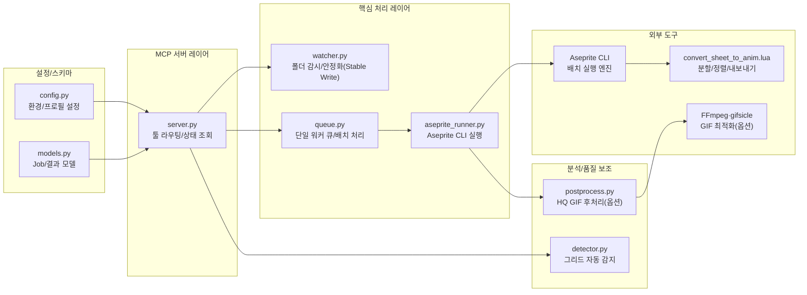

# 📊 프로젝트 종합 평가 보고서

> 이 문서는 Vibe Coding Report VS Code 확장에서 자동으로 관리됩니다.

---

<!-- AUTO-OVERVIEW-START -->
## 📋 프로젝트 개요

- **프로젝트 목적:** Aseprite CLI + Lua 기반으로 스프라이트시트(단일 이미지)를 게임 엔진용 애니메이션 에셋으로 자동 변환하는 MCP 서버 제공
- **핵심 목표:** AI 에이전트가 MCP 툴을 통해 입력 스캔/감시 → 변환(그리드 감지·앵커 정렬·배경 처리) → 산출물 생성 → 원본 정리(processed/failed)까지 자동화
- **대상 사용자:** 픽셀 아트/스프라이트 기반 게임 개발자, 테크니컬 아티스트, 아트 파이프라인 자동화가 필요한 소규모 팀/개인
- **주요 사용 시나리오:** (1) 폴더 감시 기반 자동 처리(`watch_start`) (2) inbox 일괄 변환(`convert_inbox`) (3) 단일 파일 변환(`convert_file`) (4) 그리드 감지 검증(`dry_run_detect`) (5) 상태/헬스 조회(`status`) (6) 환경 진단(`doctor`)
- **전략적 포지션:** “이미지 → 애니메이션 에셋” 변환을 MCP 툴로 표준화하여, 에이전트(프롬프트)·그래픽 툴(Aseprite)·게임 엔진(Unity/Godot) 사이의 제작 자동화를 연결하는 허브
- **기술 스택:** Python(MCP 서버) + Pydantic(v2) + Aseprite CLI + Lua(변환 스크립트) + Pillow(그리드/프레임 분석) + watchfiles(감시) + (선택) FFmpeg/gifsicle(HQ GIF)
- **주요 산출물:** `anim.aseprite`, `anim_sheet.png/json`, `anim_preview.gif`(HQ 옵션 시 대체 생성), `meta.json`, `job.log`, `aseprite_stdout.txt/aseprite_stderr.txt`
- **구성/확장 포인트:** 프로필(`game_default/unity_default/godot_default/preview_only`) + 입력 옆 `.job.json`(사이드카 오버라이드) + 툴 인자 오버라이드(최우선) + `workspace_root` 기반 멀티 워크스페이스 컨텍스트
- **현재 성숙도:** 베타(핵심 파이프라인/테스트/CI/진단/로그 체계는 구축됨. 남은 과제는 “경로 정책의 완결성”, “코드 포맷 일관성”, “감지 알고리즘 고도화” 중심)
- **리포지토리 스냅샷:** 2025-12-23 기준(워크스페이스 내용·캐시 제외) 파일 37개/디렉터리 9개, 주요 언어: Python(24)·Markdown(6)·Lua(1)·YAML(1)·JSON(3)
<!-- AUTO-OVERVIEW-END -->

---

<!-- AUTO-STRUCTURE-START -->
## 📐 프로젝트 구조

### 🧭 기능 기반 패키지/모듈 다이어그램

- **주요 진입점:** `ss-anim-mcp`(스크립트) → `ss_anim_mcp.server:main`
- **주요 데이터 흐름:** `workspace/inbox` 입력 → 감시/큐잉 → Aseprite CLI+Lua 변환 → `workspace/out/<job>` 산출물 생성 → 원본은 `processed/` 또는 `failed/`로 이동

<!-- AUTO-STRUCTURE-END -->

---

<!-- AUTO-SCORE-START -->
## 📊 종합 점수 요약

### ✅ 점수 ↔ 등급 기준(고정)

| 점수 범위 | 등급 | 색상 | 의미 |
|:---:|:---:|:---:|:---:|
| 97–100 | A+ | 🟢 | 최우수 |
| 93–96 | A | 🟢 | 우수 |
| 90–92 | A- | 🟢 | 우수 |
| 87–89 | B+ | 🔵 | 양호 |
| 83–86 | B | 🔵 | 양호 |
| 80–82 | B- | 🔵 | 양호 |
| 77–79 | C+ | 🟡 | 보통 |
| 73–76 | C | 🟡 | 보통 |
| 70–72 | C- | 🟡 | 보통 |
| 67–69 | D+ | 🟠 | 미흡 |
| 63–66 | D | 🟠 | 미흡 |
| 60–62 | D- | 🟠 | 미흡 |
| 0–59 | F | 🔴 | 부족 |

### 📌 글로벌 점수 테이블

> ※ 카테고리별 과거 점수 이력이 구조화되어 있지 않아, **이번 평가를 기준선**으로 삼고 변화는 `—`로 표기합니다.

| 항목 | 점수 (100점 만점) | 등급 | 변화 |
|------|------------------|------|------|
| **코드 품질** | 88 | 🔵 B+ | — |
| **아키텍처 설계** | 87 | 🔵 B+ | — |
| **보안** | 81 | 🔵 B- | — |
| **성능** | 85 | 🔵 B | — |
| **테스트 커버리지** | 88 | 🔵 B+ | — |
| **에러 처리** | 88 | 🔵 B+ | — |
| **문서화** | 84 | 🔵 B | — |
| **확장성** | 83 | 🔵 B | — |
| **유지보수성** | 85 | 🔵 B | — |
| **프로덕션 준비도** | 84 | 🔵 B | — |
| **총점 평균** | **85** | **🔵 B** | — |

### 산정 근거(요약)
- **코드 품질(88/B+):** 타입 힌트·Pydantic 검증·헬퍼 함수 분리로 전반 품질이 양호합니다. 다만 일부 파일에서 라인엔딩/포맷 혼재가 확인되어(리뷰/패치 난이도 증가) 감점 요인이 있습니다.
- **아키텍처(87/B+):** 서버-감시-큐-러너-후처리 레이어가 분리되어 있으며, `workspace_root` 기반 컨텍스트로 멀티 워크스페이스 운영이 가능합니다. 컨텍스트 수명주기(정리/상한) 정책은 추가 여지입니다.
- **보안(81/B-):** `processed_dir/failed_dir` 오버라이드에 대해 워크스페이스 경계 검증이 적용되어 개선되었습니다. 반면 `inbox_dir/out_dir/input_path` 등 일부 경로 인자에 대한 정책 일관화가 미완입니다.
- **성능(85/B):** `convert_inbox`는 `os.scandir` + 부분 선택으로 대용량 스캔 비용이 낮아졌고, 그리드 감지는 샘플링/캐시로 최적화되었습니다. 장시간 watcher 실행 시 내부 상태 누적(메모리) 리스크는 남습니다.
- **테스트(88/B+):** 출력 검증/경로 정책/실패 보존/멀티 워크스페이스/Watcher health 등 핵심 시나리오를 유닛 테스트로 커버하고 CI(3.10~3.12)를 갖췄습니다. Aseprite 포함 E2E(실변환) 테스트는 제한적입니다.
- **에러 처리(88/B+):** 구조화된 `error_code` 응답, `job.log`/stdout·stderr 파일 보존, 산출물 검증으로 운영 진단성이 높습니다. Lua 조기 종료 시 에러 메타를 더 구조화하면 디버깅 경험이 개선됩니다.
- **문서화(84/B):** README에 설치/환경 변수/`.job.json` 사용이 정리되어 있습니다. `workspace_root`/경로 정책/보안 가이드 및 운영 팁(권한/경로 예시)은 보강 여지가 있습니다.
- **확장성(83/B):** 멀티 워크스페이스 컨텍스트와 프로필/오버라이드로 확장성이 확보되었습니다. 처리량 확장은 단일 워커 구조 상 제약이 있습니다.
- **유지보수성(85/B):** 모듈 경계가 명확하고 테스트가 있어 변경 안전성이 높습니다. 다만 포맷/라인엔딩의 일관화(자동화 포함)는 필요합니다.
- **프로덕션 준비도(84/B):** CI/doctor/status 기반 운영 준비 요소가 갖춰졌습니다. 경로 정책 완결성/릴리스 규칙/오류 표준(메타 포함) 정비가 남아 있습니다.
<!-- AUTO-SCORE-END -->

---

<!-- AUTO-DETAIL-START -->
## 🔍 기능별 상세 평가

### 1) MCP 서버/툴 라우팅 (`src/ss_anim_mcp/server.py`)
- **기능 완성도:** 핵심 툴 7종(`watch_start/stop`, `convert_inbox`, `convert_file`, `status`, `dry_run_detect`, `doctor`)을 제공하며, `workspace_root` 기반으로 워크스페이스 컨텍스트를 분리해 운영 가능
- **코드 품질:** `WorkspaceContext` + 헬퍼(`list_inbox_files`, `_resolve_override_dir`)로 책임이 분리되어 가독성이 좋음. 다만 `_contexts` 캐시의 정리/상한 정책은 부재
- **에러 처리:** `error_code` 중심의 구조화 응답과 예외 타입별 처리로 추적성이 높음. 경로 인자(`inbox_dir/out_dir/input_path/out_dir`)에 대한 검증/정규화 적용은 아직 불균일
- **성능:** `convert_inbox`가 `os.scandir` + 부분 선택(`heapq.nsmallest`)로 최적화되어 대용량 inbox에서도 비용이 완화됨
- **강점:** `status/doctor`로 운영 상태/환경 진단이 가능하고, 결과에 로그 경로를 포함해 자동화(에이전트) 친화적
- **약점/리스크:** 워크스페이스 경계 정책이 일부 경로 인자에 누락될 수 있어 보안/운영 사고 가능성(`sec-path-policy-001`)

### 2) 폴더 감시/안정화 (`src/ss_anim_mcp/watcher.py`)
- **기능 완성도:** Stable Write 가드 + `watchfiles` 기반 감시 + 폴링 폴백을 제공해 “복사 중 파일 처리”를 실사용 수준에서 방지
- **코드 품질:** 상태/헬스(`error_count/last_error/last_scan_at`)가 추가되어 관측성이 향상. 다만 라인엔딩/포맷 혼재가 확인되어 유지보수 비용이 증가(`maint-line-endings-001`)
- **에러 처리:** watchfiles/폴링 루프에서 예외 로깅 및 에러 카운터를 유지해 장애 탐지가 가능
- **성능:** `watchfiles`는 효율적이나 폴링 폴백은 디렉터리 크기에 비례해 비용 증가. 또한 `_processed_files` 및 폴링용 `seen_files` 누적이 장기 실행에서 부담이 될 수 있음(`opt-watcher-state-prune-001`)
- **강점:** 안정화 체크로 입력 파이프라인의 실패율을 낮추고, 상태 지표로 운영 진단이 쉬움
- **약점/리스크:** 장시간 실행 시 내부 상태 누적/정리 정책 부재(메모리), 이벤트 폭주 시 백오프/스로틀 정책은 제한적

### 3) 작업 큐/배치 처리 (`src/ss_anim_mcp/queue.py`)
- **기능 완성도:** 단일 워커로 Aseprite 동시 실행 충돌을 회피하며, 동기 배치 처리(`process_batch`)도 제공. `processed_dir/failed_dir` 오버라이드 및 실패 실행별 디렉터리 보존이 지원됨
- **코드 품질:** `QueuedJob` + `current_job` 스냅샷으로 가시성이 좋음. 통계(`recent_*`)는 누적값 형태라 운영 대시보드 관점에서 “윈도우/리셋” 개선 여지는 있음
- **에러 처리:** 실패 시 `error.txt`/`job.log` 기록 및 `failed/<stem>/<run_id>/` 구조로 보존해 재현/비교에 유리
- **성능:** 안정성 우선(동시성 1)으로 처리량 확장에는 한계가 있으며, 대형 배치에서 진행률/취소/타임아웃 같은 운영 기능은 제한적
- **강점:** 성공/실패 후 원본 이동이 자동화되어 운영 플로우가 단순하며, 실패 이력 보존으로 분석 효율이 높음
- **약점/리스크:** 장기적으로는 동시 처리/우선순위/취소 등 큐 운영 기능 요구가 발생할 수 있음

### 4) 변환 실행/외부 도구 연동 (`src/ss_anim_mcp/aseprite_runner.py`, `aseprite_scripts/convert_sheet_to_anim.lua`)
- **기능 완성도:** 스프라이트 분할 → 배경 처리 → 앵커 정렬 → 산출물 내보내기 + `hq_gif` 옵션(FFmpeg)까지 파이프라인이 연결됨
- **코드 품질:** `--script-param` 조립이 설정 모델과 결합되어 일관성이 높고, 산출물 계약 검증 헬퍼로 테스트 가능. 서브프로세스는 리스트 인자 기반(쉘 인젝션 위험 낮음)
- **에러 처리:** stdout/stderr 저장 + `job.log`(cmd/returncode/시간/HQ GIF 상태) + 산출물 계약 검증(`OUTPUT_VALIDATION_FAILED`)로 “조용한 성공”을 방지
- **성능:** 비용은 외부 변환(Aseprite/Lua)이 지배적. Lua의 픽셀 루프(배경 제거/앵커 계산)는 큰 프레임에서 병목 가능
- **강점:** 작업 폴더 단위로 결과/로그가 정리되어 자동화·재처리에 유리
- **약점/리스크:** Lua 조기 종료 경로에서 `meta.json`을 남기지 않아 실패 원인이 “누락 파일”로만 요약될 수 있음(에러 메타 구조화 여지: `obs-lua-error-meta-001`). 배경 제거는 현재 “색상 매칭 치환”이며 flood-fill 기반 고도화는 향후 과제

### 5) 그리드 자동 감지 (`src/ss_anim_mcp/detector.py`)
- **기능 완성도:** 갭 분석 + common grid 폴백 + 신뢰도(0~1) 반환으로 “자동 감지→검증” 흐름을 지원
- **코드 품질:** 샘플링 기반 스캔 + 파일(크기/mtime) 캐시로 호출 비용을 낮춤. 내부 캐시 상태 헬퍼(`_cache_info/_clear_cache`)로 테스트 가능
- **에러 처리:** Pillow 미가용/분석 실패 시 예외 대신 `detected=False`와 `notes`로 반환
- **성능:** 대용량 입력에서 개선 여지가 남지만, 샘플링/캐시로 기본 응답성은 확보
- **강점:** 자동 감지 실패 시에도 합리적인 폴백으로 “최소 동작”을 보장
- **약점/리스크:** 오프셋/패딩 추정은 미지원(항상 0)이라 다양한 스프라이트시트(마진/패딩 포함)에서 정확도 한계가 있음(`feat-grid-offset-pad-detect-001`)

### 6) 설정/스키마 (`src/ss_anim_mcp/config.py`, `src/ss_anim_mcp/models.py`)
- **기능 완성도:** 프로필 + `.job.json`(사이드카) + 툴 인자(최우선)로 설정 우선순위가 명확하며, 변환 재현성을 높임
- **코드 품질:** Pydantic 모델 + `Literal` 제약/정규화로 fail-fast 검증이 가능
- **에러 처리:** 오버라이드 JSON/스키마 오류는 `JOB_OVERRIDE_INVALID`로 구조화되어 호출자(에이전트)가 대응하기 쉬움
- **성능:** 설정/검증 비용은 미미
- **강점:** 설정 계층이 분리되어 신규 프로필/옵션 추가가 비교적 용이
- **약점/리스크:** `get_settings()`는 전역 캐시를 사용하므로, 향후 컨텍스트가 더 확대될 경우(예: 라이브러리로 임베드) 설정 객체의 수명주기/격리 정책을 명확히 할 필요가 있음

### 7) 후처리(옵션) (`src/ss_anim_mcp/postprocess.py`)
- **기능 완성도:** 스프라이트시트 PNG+JSON에서 프레임을 추출하고(트림/비트림 모두), FFmpeg 팔레트 최적화로 HQ GIF를 생성(옵션)
- **코드 품질:** 임시 디렉터리 정리 및 gifsicle 최적화(선택)가 모듈화되어 있으며, 테스트에서 FFmpeg 실행을 모킹해 안정성을 확보
- **에러 처리:** 실패 시 False 반환 + 예외 로깅(베스트 에포트). 다만 외부 도구 stderr를 파일로 남기는 관측성은 추가 여지
- **성능:** HQ GIF는 비용이 크므로 옵션/캐시 정책이 중요(현재는 실행 후 임시 프레임 정리)
- **강점:** 선택 기능으로 결과물 품질을 개선하면서 기본 플로우를 해치지 않음
- **약점/리스크:** 외부 도구 의존(FFmpeg/gifsicle)로 환경별 편차가 있으며, 운영 가이드(권장 설치/폴백 정책) 정교화 필요

### 8) 테스트/CI (`tests/`, `.github/workflows/ci.yml`)
- **기능 완성도:** 출력 검증/경로 정책/실패 보존/멀티 워크스페이스/Watcher health 등 핵심 리스크 영역을 유닛 테스트로 커버하며, CI에서 `compileall + pytest`를 수행
- **코드 품질:** `tmp_path` 기반으로 외부 도구(Aseprite/FFmpeg) 의존 없이 핵심 로직을 검증해 안정적
- **에러 처리:** 실패 케이스를 명시적으로 테스트하여 회귀를 방지(예: `OUTPUT_VALIDATION_FAILED`, `PATH_OUTSIDE_WORKSPACE`)
- **성능:** 테스트는 비교적 가볍지만, 실제 Aseprite를 포함한 E2E(실변환) 검증은 별도 환경에서 보완 필요
- **강점:** 리팩토링/확장 시 회귀를 빠르게 탐지할 수 있는 기반이 마련됨
- **약점/리스크:** 파일 시스템 이벤트/외부 도구 의존 E2E 시나리오가 없으므로, 릴리스 전 수동/별도 파이프라인 검증 체계가 있으면 더 안전
<!-- AUTO-DETAIL-END -->

---

<!-- AUTO-TREND-START -->
## 📈 평가 추세

- 세션 기록(`devplan/Session_History.md`)은 존재하나, **카테고리별 점수/총점 이력은 구조화되어 누적되지 않았습니다.**
- 따라서 이번 평가(2025-12-23)를 **기준선**으로 기록하며, 다음 평가부터 최근 최대 5회까지 추세를 비교합니다.

| 버전 | 날짜 | 총점 | 비고 |
|:---:|:---:|:---:|:---|
| 기준선 | 2025-12-23 | **85 (B)** | 최초 기준선 |

| 카테고리 | 현재 점수 | 등급 | 추세 |
|:---|:---:|:---:|:---:|
| 코드 품질 | 88 | 🔵 B+ | 기준선 |
| 아키텍처 설계 | 87 | 🔵 B+ | 기준선 |
| 보안 | 81 | 🔵 B- | 기준선 |
| 성능 | 85 | 🔵 B | 기준선 |
| 테스트 커버리지 | 88 | 🔵 B+ | 기준선 |
| 에러 처리 | 88 | 🔵 B+ | 기준선 |
| 문서화 | 84 | 🔵 B | 기준선 |
| 확장성 | 83 | 🔵 B | 기준선 |
| 유지보수성 | 85 | 🔵 B | 기준선 |
| 프로덕션 준비도 | 84 | 🔵 B | 기준선 |
<!-- AUTO-TREND-END -->

---

<!-- AUTO-TLDR-START -->
## ✅ TL;DR (한눈에 보기)

| 항목 | 값 |
|------|-----|
| **전체 등급** | 🔵 B (85점) |
| **전체 점수** | 85/100 |
| **가장 큰 리스크** | 일부 툴에서 입력/출력 경로 인자에 대한 워크스페이스 경계 검증이 불균일하여, 의도치 않은 외부 경로 접근 가능 |
| **권장 최우선 작업** | `sec-path-policy-001`: 모든 경로 인자 정규화 + 경계 검증 + `allow_external_paths` 정책 일원화 |
| **단기 추천(2주)** | `maint-line-endings-001`, `obs-lua-error-meta-001`, `opt-watcher-state-prune-001` |
| **중기 추천(4~6주)** | `feat-grid-offset-pad-detect-001` |
<!-- AUTO-TLDR-END -->

---

<!-- AUTO-RISK-SUMMARY-START -->
## ⚠️ 리스크 요약

| 리스크 레벨 | 항목 | 관련 개선 ID |
|------------|------|-------------|
| 🔴 High | `convert_file`/`watch_start` 등에서 입력/출력/디렉터리 경로 인자의 경계 검증·정규화가 불균일(워크스페이스 외부 경로 접근 가능) | sec-path-policy-001 |
| 🟡 Medium | Lua 스크립트 조기 종료 시 `meta.json`이 남지 않아 실패 원인이 “산출물 누락”으로만 요약될 수 있음(디버깅 비용 증가) | obs-lua-error-meta-001 |
| 🟡 Medium | `FolderWatcher` 장시간 실행 시 `_processed_files`/폴링 상태(`seen_files`)가 누적되어 메모리 사용이 증가할 수 있음 | opt-watcher-state-prune-001 |
| 🟡 Medium | 코드/스크립트 파일의 라인엔딩·포맷 혼재로 변경 diff가 커지고 협업/자동화 품질이 저하 | maint-line-endings-001 |
| 🟢 Low | 그리드 감지가 offset/pad(마진/패딩) 추정을 지원하지 않아 일부 스프라이트시트에서 자동 감지 정확도 한계 | feat-grid-offset-pad-detect-001 |
<!-- AUTO-RISK-SUMMARY-END -->

---

<!-- AUTO-SCORE-MAPPING-START -->
## 🔗 점수 ↔ 개선 항목 매핑

| 카테고리 | 현재 점수 | 주요 리스크 | 관련 개선 항목 ID |
|----------|----------|------------|------------------|
| 보안 | 81 (B-) | 경로 인자 정책/경계 검증 불완전 | sec-path-policy-001 |
| 코드 품질 | 88 (B+) | 라인엔딩/포맷 혼재로 유지보수 비용 증가 | maint-line-endings-001 |
| 에러 처리 | 88 (B+) | Lua 조기 실패 원인 메타 구조화 부족 | obs-lua-error-meta-001 |
| 성능 | 85 (B) | watcher 상태 누적(장시간 실행) | opt-watcher-state-prune-001 |
| 확장성 | 83 (B) | offset/pad 미지원으로 다양한 입력 대응 한계 | feat-grid-offset-pad-detect-001 |
<!-- AUTO-SCORE-MAPPING-END -->

---

<!-- AUTO-SUMMARY-START -->
## 🧾 현재 상태 요약

- **전체 준비도:** 베타 단계이며 핵심 변환 파이프라인/로그/테스트/CI가 갖춰져 실제 운영 실험이 가능한 상태입니다. 다만 일부 툴의 경로 인자에 대한 경계 검증이 불균일하여 보안/운영 사고 가능성이 남아 있습니다.
- **주요 강점:** (1) `job.log`/stdout·stderr/`meta.json` 기반 추적성 (2) `workspace_root` 컨텍스트로 프로젝트별 격리 운영 (3) 실패 보존(`failed/<stem>/<run_id>/`) 및 상태/진단(`status/doctor`) 제공 (4) 유닛 테스트/CI로 회귀 방지
- **상위 리스크(Top 3):** (1) 경로 정책 미완(`sec-path-policy-001`) (2) watcher 내부 상태 누적(`opt-watcher-state-prune-001`) (3) Lua 실패 메타 구조화 미흡(`obs-lua-error-meta-001`)
- **즉시 권장 액션:** `sec-path-policy-001` 적용을 최우선으로 진행하고, 병행 또는 후속으로 `maint-line-endings-001`(포맷 일관화) + `opt-watcher-state-prune-001`/`obs-lua-error-meta-001`를 순차 적용
<!-- AUTO-SUMMARY-END -->
