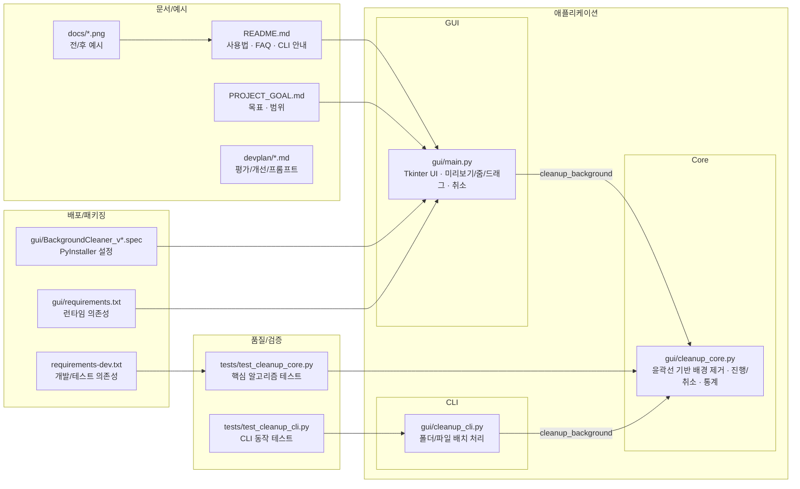

# 📊 프로젝트 종합 평가 보고서

> 이 문서는 Vibe Coding Report VS Code 확장에서 자동으로 관리됩니다.

---

<!-- AUTO-OVERVIEW-START -->
## 📋 프로젝트 개요

- **프로젝트 목적:** AI 생성 이미지(특히 **윤곽선이 있는 픽셀아트/일러스트**)의 **외곽 배경을 자동 제거**하여 후처리 시간을 단축하는 로컬 도구 제공
- **프로젝트 비전:** (1) 최소 조작으로 빠른 처리 (2) 파라미터 기반 **재현 가능한 결과** (3) GUI/CLI 모두 지원하는 경량 워크플로 확립
- **대상 사용자:** 픽셀 아트/일러스트 제작자, 인디 게임/콘텐츠 제작자, 반복적인 배경 제거가 필요한 개인·소규모 팀
- **주요 사용 시나리오:** (GUI) 이미지 열기 → 파라미터 조정 → 처리/취소 → 결과 비교(줌/드래그) → PNG 저장 · (CLI) 폴더/파일 일괄 처리 → 결과 PNG 생성
- **전략적 포지션:** (1) 개인정보/원본 유출 없이 **오프라인**에서 처리 (2) 편집 툴 이전 단계의 **경량 전처리/후처리**로 활용 (3) 테스트/CI 기반으로 안정적 개선이 가능한 구조 지향
- **기술 스택:** Python 3.10+ · Tkinter(UI) · Pillow(이미지) · threading(비동기) · PyInstaller(EXE) · pytest(개발/테스트)
- **주요 산출물:** 투명 배경 PNG, 처리 통계(`pixels_removed`, `removal_percentage`, `processing_time_ms` 등), CLI 처리 결과 요약
- **현재 성숙도:** 핵심 기능(단일 이미지 GUI, 배치 CLI, 취소, 기본 테스트)은 갖추었으나, **CI/릴리스 표준화·대형 이미지 성능/메모리 최적화**가 다음 단계의 핵심 과제
- **리포지토리 기준:** 2025-12-24 작업 트리 기준(브랜치 `master`), `gui/` 중심 소형 코드베이스 + `tests/` + `devplan/`
<!-- AUTO-OVERVIEW-END -->

---

<!-- AUTO-STRUCTURE-START -->
## 📐 프로젝트 구조

### 🧭 기능 기반 패키지/모듈 다이어그램

- **주요 진입점:** `gui/main.py`(GUI), `gui/cleanup_cli.py`(CLI)
- **핵심 도메인 로직:** `gui/cleanup_core.py`
- **주요 데이터 흐름:** 이미지 로드 → 윤곽선 기반 배경 제거 → 결과 미리보기/저장 또는 배치 출력
- **배포 구성:** `*.spec` 기반 PyInstaller 빌드(Windows EXE)

<!-- AUTO-STRUCTURE-END -->

---

<!-- AUTO-SCORE-START -->
## 📊 종합 점수 요약

### ✅ 점수 ↔ 등급 기준(고정)

| 점수 범위 | 등급 | 색상 | 의미 |
|:---:|:---:|:---:|:---:|
| 97–100 | A+ | 🟢 | 최우수 |
| 93–96 | A | 🟢 | 우수 |
| 90–92 | A- | 🟢 | 우수 |
| 87–89 | B+ | 🔵 | 양호 |
| 83–86 | B | 🔵 | 양호 |
| 80–82 | B- | 🔵 | 양호 |
| 77–79 | C+ | 🟡 | 보통 |
| 73–76 | C | 🟡 | 보통 |
| 70–72 | C- | 🟡 | 보통 |
| 67–69 | D+ | 🟠 | 미흡 |
| 63–66 | D | 🟠 | 미흡 |
| 60–62 | D- | 🟠 | 미흡 |
| 0–59 | F | 🔴 | 부족 |

### 📌 글로벌 점수 테이블

> ※ 등급은 위 **점수 ↔ 등급 기준**을 그대로 적용해 산출했습니다.  
> ※ 변화는 `.vscode/vibereport-state.json`의 **직전 평가(2025-12-24 10:10)** 대비이며, 비교 데이터가 없는 항목은 `—`로 표기합니다.

| 항목 | 점수 (100점 만점) | 등급 | 변화 |
|------|------------------|------|------|
| **기능 완성도** | 88 | 🔵 B+ | — |
| **코드 품질** | 84 | 🔵 B | ⬆️ +4 |
| **테스트 커버리지** | 84 | 🔵 B | ⬆️ +24 |
| **문서화** | 85 | 🔵 B | ⬆️ +7 |
| **성능/효율** | 77 | 🟡 C+ | ⬆️ +3 |
| **에러 처리/안정성** | 83 | 🔵 B | ⬆️ +5 |
| **UX/사용성** | 88 | 🔵 B+ | — |
| **배포/유지보수** | 72 | 🟡 C- | — |
| **총점 평균** | **83** | **🔵 B** | ⬆️ +6 |

### 산정 근거(요약)
- **기능 완성도(88/B+):** GUI 단일 이미지 워크플로와 CLI 배치 처리 경로가 모두 존재하고, 취소/진행률 등 핵심 사용자 흐름이 갖춰져 있습니다.
- **코드 품질(84/B):** 규모가 작아 이해는 쉬우나 `gui/main.py`에 UI/상태/렌더링 책임이 집중되어 유지보수성이 떨어질 수 있습니다(`pkg-layout-001`로 구조 정비 권장).
- **테스트 커버리지(84/B):** `tests/`에 핵심 알고리즘/CLI 테스트가 존재하나, CI에서 자동 실행되지 않아 회귀 차단(게이트)이 약합니다(`ci-pipeline-001`).
- **문서화(85/B):** README/목표 문서가 사용자 가이드로 충분한 편이나, 개발/릴리스 절차(재현 가능한 빌드/검증) 문서화가 보강되면 운영 준비도가 상승합니다(`release-artifact-001`).
- **성능/효율(77/C+):** dilation은 경계(프론티어) 중심으로 최적화되어 있으나, 대형 이미지에서의 메모리/반복 연산 비용이 남아 있습니다(`opt-cleanup-core-memory-001`).
- **에러 처리/안정성(83/B):** 파일 I/O 예외 처리와 취소 경로가 존재하며, 실패 시 UI 복구 흐름이 있습니다. 다만 입력/파라미터 검증과 진단 메시지 표준화는 개선 여지가 있습니다.
- **UX/사용성(88/B+):** 원본/결과 패널 분리, 줌/드래그, 진행률/취소로 학습 비용이 낮습니다(프리셋/프로파일은 향후 개선 여지: `feat-gui-preset-001`).
- **배포/유지보수(72/C-):** PyInstaller 스펙/EXE 산출 경로는 있으나, CI 부재·리포지토리 아티팩트(바이너리/캐시) 관리가 불명확해 협업/배포 안정성이 제한됩니다(`ci-pipeline-001`, `release-artifact-001`).
<!-- AUTO-SCORE-END -->

---

<!-- AUTO-DETAIL-START -->
## 🔍 기능별 상세 평가

### 1) GUI 애플리케이션 (`gui/main.py`)
- **기능 완성도:** 이미지 열기/저장, 파라미터 조정(슬라이더+입력), 원본/결과 비교, 줌/드래그, 진행률/상태 표시, **처리 취소(Cancel)**까지 핵심 GUI 흐름이 갖춰져 있습니다.
- **코드 품질:** `BackgroundCleanerApp` 단일 클래스에 UI/상태/렌더링/스레딩이 집중되어 결합도가 높습니다(구조 정비 과제: `pkg-layout-001`).
- **에러 처리:** 열기/저장/처리 예외를 사용자 메시지로 노출하고, 취소 예외(`CancelledError`)를 정상 플로우로 처리합니다. 다만 입력값 검증(슬라이더/입력 동기화, 범위/타입) 표준화는 보강 여지가 있습니다.
- **성능:** 화면 렌더링에서 리사이즈/합성이 반복되어 고해상도·고배율에서 지연이 발생할 수 있습니다(렌더 캐시/업데이트 최소화 등 향후 개선 여지).
- **강점:** 조작이 단순하고(툴바 중심), 결과 비교가 빠르며, 취소를 제공해 장시간 작업의 제어성이 확보되어 있습니다.
- **약점/리스크:** “프리셋/프로파일”이 없어 사용자가 상황별 파라미터를 반복 설정해야 합니다(`feat-gui-preset-001`).

### 2) 배경 제거 알고리즘 (`gui/cleanup_core.py`)
- **기능 완성도:** (1) 가장자리 flood-fill (2) 윤곽선 보호(protected) (3) 경계(프론티어) 기반 dilation (4) 고립 잔여물 정리까지 포함하며, 진행/취소 및 stats를 제공합니다.
- **코드 품질:** 단계가 명확히 나뉘어 있으나 `cleanup_background()` 단일 함수에 로직이 길게 집중되어 있고, 2차원 불리언 배열(visited/removed/protected)로 인해 복잡도/메모리 비용이 큽니다(`opt-cleanup-core-memory-001`).
- **에러 처리:** 입력 이미지는 RGBA로 정규화하며, 취소 체크포인트를 통해 장시간 루프를 중단할 수 있습니다. 반면 파라미터(극단값) 가드/입력 사전 조건은 제한적입니다.
- **성능:** 프론티어 기반으로 “패스 × 전체 스캔” 병목은 줄었으나, 대형 이미지에서 **메모리 사용량과 후보 집합 정렬/순회 비용**이 남아 있습니다(`opt-cleanup-core-memory-001`).
- **강점:** 외부 툴 의존이 없고(Pillow만), 결과가 파라미터로 재현 가능하며, 취소/진행 콜백으로 UI/자동화에 연결하기 쉽습니다.
- **약점/리스크:** 대형 이미지에서 처리 시간이 길어지거나 메모리 압박이 커질 수 있으며, 성능 회귀를 상시 감시하는 CI/벤치마크 체계가 부족합니다(`ci-pipeline-001`).

### 3) 배치 처리 CLI (`gui/cleanup_cli.py`)
- **기능 완성도:** 파일/폴더 입력을 받아 PNG(RGBA)로 일괄 저장하고, 성공/실패 요약 및 종료 코드를 제공합니다.
- **코드 품질:** 함수 분리가 단순하고(`_iter_input_files`, `main`) 예외 처리 흐름이 명확합니다.
- **에러 처리:** 입력 경로 검증 및 파일별 예외를 격리(실패는 stderr로 출력, 다음 파일 계속)합니다.
- **성능:** 단일 스레드/비재귀 순회로 단순하나, 대량·중첩 폴더 입력에서 사용성이 제한될 수 있습니다(`cli-recursive-001`).
- **강점:** GUI 없이 자동화/파이프라인에 쉽게 연결 가능하며, 결과물 규칙이 예측 가능합니다.
- **약점/리스크:** 비재귀 처리/옵션 확장(예: `fill_tolerance`) 부재로 실제 작업 폴더 구조에 대한 적합성이 떨어질 수 있습니다(`cli-recursive-001`).

### 4) 테스트/품질 (`tests/`)
- **기능 완성도:** 핵심 알고리즘(`test_cleanup_core.py`)과 CLI(`test_cleanup_cli.py`)에 대해 결정적(합성 이미지 기반) 테스트가 존재합니다.
- **코드 품질:** 테스트가 핵심 경로를 보호하지만, GUI 영역은 자동 테스트가 어렵고(프레임워크 특성) 테스트 범위를 확장하는 설계가 필요합니다.
- **에러 처리:** 취소 예외 및 출력 파일 생성 등 주요 실패 경로가 일부 커버되지만, 입력 다양성(윤곽선 단절/코너 배경 불일치/반투명 경계) 확장은 여지가 있습니다.
- **성능:** 현재는 기능 회귀 중심이며, 성능 회귀를 감시하는 최소 기준(벤치마크/상한)과 CI 실행이 필요합니다(`ci-pipeline-001`).
- **강점:** 외부 이미지 의존 없이 테스트가 빠르고 안정적입니다.
- **약점/리스크:** 로컬에서만 실행될 경우 회귀 차단 효과가 제한되므로, PR 단위 자동 검증이 필요합니다(`ci-pipeline-001`).

### 5) 문서/배포 (`README.md`, `PROJECT_GOAL.md`, `gui/*.spec`, `gui/dist/`)
- **기능 완성도:** 사용자 가이드/예시 이미지/빌드 스펙이 존재해 온보딩이 빠릅니다.
- **코드 품질:** 문서 구조는 양호하나, “릴리스 절차(버전/검증/산출물)”가 정형화되어 있지 않습니다.
- **에러 처리:** 문서에서 대표 실패 케이스를 안내하지만, 환경(파이썬 3.10+), 빌드/배포 재현성 안내는 보강 여지가 있습니다.
- **성능:** 직접적인 성능 이슈는 없으나, 리포지토리에 바이너리/캐시가 혼재하면 관리 비용이 커질 수 있습니다(`release-artifact-001`).
- **강점:** 배포(Windows EXE) 관점의 진입장벽이 낮습니다.
- **약점/리스크:** 아티팩트(예: `gui/dist/*.exe`) 및 개발 캐시 관리 정책이 불명확하면 버전 혼선/저장소 비대화로 이어질 수 있습니다(`release-artifact-001`).
<!-- AUTO-DETAIL-END -->

---

<!-- AUTO-TREND-START -->
## 📈 평가 추이(최근)

> 참고: 아래 “과거 점수”는 `.vscode/vibereport-state.json`의 기록이며, 코드베이스 범위 변화가 있어 절대 비교에는 한계가 있습니다. 본 보고서의 “현재 점수”는 **현 작업 트리 기준**으로 재산정했습니다.

| 구분 | 기준 | 총점 | 등급 |
|:---:|:---|:---:|:---:|
| 과거 | 2025-12-23 | 74 | C |
| 과거 | 2025-12-23 | 83 | B |
| 과거 | 2025-12-24 08:06 | 85 | B |
| 직전 | 2025-12-24 10:10 | 77 | C+ |
| **현재** | 2025-12-24 | **83** | **B** |

| 카테고리 | 직전(2025-12-24 10:10) | 현재(2025-12-24) | 추세 |
|:---|:---:|:---:|:---:|
| 코드 품질 | 80 (🔵 B-) | 84 (🔵 B) | 개선 |
| 테스트 커버리지 | 60 (🟠 D-) | 84 (🔵 B) | 개선 |
| 문서화 | 78 (🟡 C+) | 85 (🔵 B) | 개선 |
| 성능/효율 | 74 (🟡 C) | 77 (🟡 C+) | 개선 |
| 에러 처리/안정성 | 78 (🟡 C+) | 83 (🔵 B) | 개선 |
<!-- AUTO-TREND-END -->

---

<!-- AUTO-TLDR-START -->
## ✅ TL;DR (한눈에 보기)

| 항목 | 값 |
|------|-----|
| **전체 등급** | 🔵 B (83점) |
| **전체 점수** | 83/100 |
| **평가 기준** | 2025-12-24 (작업 트리 기준) |
| **가장 큰 리스크** | CI/릴리스 품질 게이트 부재로 회귀가 배포까지 유입될 수 있음 |
| **권장 최우선 작업(P1)** | `ci-pipeline-001`: 테스트/정적 체크 자동 실행(CI) 구축 |
| **권장 병행 작업(P2)** | `release-artifact-001`, `pkg-layout-001` |
| **확장/최적화(P3/OPT)** | `cli-recursive-001`, `feat-gui-preset-001`, `opt-cleanup-core-memory-001` |
<!-- AUTO-TLDR-END -->

---

<!-- AUTO-RISK-SUMMARY-START -->
## ⚠️ 리스크 요약

| 리스크 레벨 | 항목 | 관련 개선 ID |
|------------|------|-------------|
| 🔴 High | CI 부재로 테스트가 로컬 실행에 의존 → 회귀/릴리스 품질 게이트가 약함 | `ci-pipeline-001` |
| 🟡 Medium | `cleanup_core`의 2D 불리언 배열/후보 집합 처리로 대형 이미지에서 메모리·시간 비용 증가 | `opt-cleanup-core-memory-001` |
| 🟡 Medium | 리포지토리 내 바이너리/캐시 혼재 시 버전 혼선·저장소 비대화·배포 재현성 저하 | `release-artifact-001` |
| 🟡 Medium | `gui/` 비패키지 구조로 import/테스트 경로가 취약하고 구조 변경 영향이 큼 | `pkg-layout-001` |
| 🟢 Low | CLI가 비재귀 순회만 지원하여 중첩 폴더 입력 시 작업 효율이 낮음 | `cli-recursive-001` |
| 🟢 Low | 사용 시나리오별 파라미터 프리셋/프로파일 부재로 반복 설정 비용 발생 | `feat-gui-preset-001` |
<!-- AUTO-RISK-SUMMARY-END -->

---

<!-- AUTO-SCORE-MAPPING-START -->
## 🔗 점수 ↔ 개선 항목 매핑

| 카테고리 | 현재 점수 | 주요 리스크 | 관련 개선 항목 ID |
|----------|----------|------------|------------------|
| 기능 완성도 | 88 (🔵 B+) | 중첩 폴더 입력 등 실제 작업 구조에 대한 배치 처리 적합성 제한 | `cli-recursive-001` |
| 코드 품질 | 84 (🔵 B) | UI/도메인/테스트 경로 결합으로 구조 변경 시 영향 범위 확대 | `pkg-layout-001` |
| 테스트 커버리지 | 84 (🔵 B) | CI 부재로 회귀 차단(게이트)이 약함 | `ci-pipeline-001` |
| 성능/효율 | 77 (🟡 C+) | 대형 이미지에서 메모리/반복 연산 비용 증가 | `opt-cleanup-core-memory-001` |
| UX/사용성 | 88 (🔵 B+) | 파라미터 프리셋/프로파일 부재로 반복 설정 비용 발생 | `feat-gui-preset-001` |
| 배포/유지보수 | 72 (🟡 C-) | 바이너리/캐시 관리 및 릴리스 재현성 정책 불명확 | `release-artifact-001` |
<!-- AUTO-SCORE-MAPPING-END -->

---

<!-- AUTO-SUMMARY-START -->
## 🧾 현재 상태 요약

- **전체 준비도:** 핵심 기능(단일 이미지 GUI, 배치 CLI, 취소, 기본 테스트)은 실사용 가능한 수준입니다. 다만 “배포/운영 품질 게이트(CI)”와 “릴리스/아티팩트 정책”이 미정립이라 프로덕션 관점의 안정성은 제한적입니다(`ci-pipeline-001`, `release-artifact-001`).
- **주요 강점:** (1) GUI/CLI 동시 제공으로 사용자·자동화 모두 커버 (2) 취소/진행 콜백 포함으로 장시간 작업 제어 가능 (3) 외부 툴 의존이 낮고(Pillow 중심) 결과가 파라미터로 재현 가능 (4) 합성 이미지 기반 테스트로 회귀 방지 기반 보유
- **상위 리스크(상위 3개):** (1) CI 부재로 회귀 차단 약함(`ci-pipeline-001`) (2) 대형 이미지 성능/메모리 압박(`opt-cleanup-core-memory-001`) (3) 릴리스/아티팩트·구조(패키지) 표준화 부족(`release-artifact-001`, `pkg-layout-001`)
- **즉시 권장 액션:** P1 CI를 먼저 구축(`ci-pipeline-001`)해 변경 안전성을 확보한 뒤, P2(릴리스/구조 표준화)와 OPT(메모리/성능)를 병행하고, P3(프리셋/CLI 확장)로 사용성 확장
<!-- AUTO-SUMMARY-END -->
